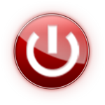

<!-- PROJECT LOGO -->
 

  

  <h3 align="center">OnMovies -   Your movies at home</h3>

  

    <a href="#"><strong>Explore the docs »</strong></a>
     
     
    <a href="https://p3p4r.github.io/onmovies/">View Demo</a>
  

<!-- TABLE OF CONTENTS -->

  
Table of Contents

  <ol>
    <li>
      <a href="#about-the-project">About The Project</a>
      <ul>
        <li><a href="#built-with">Built With</a></li>
      </ul>
    </li>
    <li>
      <a href="#getting-started">Getting Started</a>
    </li>
    <li><a href="#contributing">Contributing</a></li>
    <li><a href="#license">License</a></li>
    <li><a href="#contact">Contact</a></li>
    <li><a href="#acknowledgments">Acknowledgments</a></li>
  </ol>

<!-- ABOUT THE PROJECT -->
## About The Project

This is my first ever created HTML & CSS project for web. This is a static website. Enjoy as much as I did.

(<a href="#readme-top">back to top</a>)

### Built With

This section should list any major frameworks/libraries used to bootstrap your project. Leave any add-ons/plugins for the acknowledgements section. Here are a few examples.

* [![HTML][html.com]][html-url]
* [![CSS][css.com]][css-url]
* [![Bootstrap][Bootstrap.com]][Bootstrap-url]
* [![JQuery][JQuery.com]][JQuery-url]

(<a href="#readme-top">back to top</a>)

<!-- GETTING STARTED -->
## Getting Started

It's ready to go , just fork and check it out.

(<a href="#readme-top">back to top</a>)

<!-- CONTRIBUTING -->
## Contributing

Contributions are what make the open source community such an amazing place to learn, inspire, and create. Any contributions you make are **greatly appreciated**.

If you have a suggestion that would make this better, please fork the repo and create a pull request. You can also simply open an issue with the tag "enhancement".
Don't forget to give the project a star! Thanks again!

1. Fork the Project
2. Create your Feature Branch
3. Commit your Changes
4. Push to the Branch
5. Open a Pull Request

(<a href="#readme-top">back to top</a>)

<!-- LICENSE -->
## License

Distributed under the MIT License. See `LICENSE.txt` for more information.

(<a href="#readme-top">back to top</a>)

<!-- MARKDOWN LINKS & IMAGES -->
<!-- https://www.markdownguide.org/basic-syntax/#reference-style-links -->
[contributors-shield]: https://img.shields.io/github/contributors/p3p4r/Best-README-Template.svg?style=for-the-badge
[contributors-url]: https://github.com/p3p4r/Best-README-Template/graphs/contributors
[forks-shield]: https://img.shields.io/github/forks/p3p4r/Best-README-Template.svg?style=for-the-badge
[forks-url]: https://github.com/p3p4r/Best-README-Template/network/members
[stars-shield]: https://img.shields.io/github/stars/p3p4r/Best-README-Template.svg?style=for-the-badge
[stars-url]: https://github.com/p3p4r/Best-README-Template/stargazers
[issues-shield]: https://img.shields.io/github/issues/p3p4r/Best-README-Template.svg?style=for-the-badge
[issues-url]: https://github.com/p3p4r/Best-README-Template/issues
[license-shield]: https://img.shields.io/github/license/p3p4r/Best-README-Template.svg?style=for-the-badge
[license-url]: https://github.com/p3p4r/Best-README-Template/blob/master/LICENSE.txt
[linkedin-shield]: https://img.shields.io/badge/-LinkedIn-black.svg?style=for-the-badge&logo=linkedin&colorB=555
[linkedin-url]: https://linkedin.com/in/p3p4r
[product-screenshot]: images/screenshot.png
[Next.js]: https://img.shields.io/badge/next.js-000000?style=for-the-badge&logo=nextdotjs&logoColor=white
[Next-url]: https://nextjs.org/
[React.js]: https://img.shields.io/badge/React-20232A?style=for-the-badge&logo=react&logoColor=61DAFB
[React-url]: https://reactjs.org/
[Vue.js]: https://img.shields.io/badge/Vue.js-35495E?style=for-the-badge&logo=vuedotjs&logoColor=4FC08D
[Vue-url]: https://vuejs.org/
[html.com]: https://img.shields.io/badge/html-0769AD?style=for-the-badge&logo=jquery&logoColor=white
[html-url]: https://www.w3schools.com/html/
[CSS.com]: https://img.shields.io/badge/css-0769AD?style=for-the-badge&logo=jquery&logoColor=white
[CSS-url]: https://www.w3schools.com/css/
[Bootstrap.com]: https://img.shields.io/badge/Bootstrap-563D7C?style=for-the-badge&logo=bootstrap&logoColor=white
[Bootstrap-url]: https://getbootstrap.com
[JQuery.com]: https://img.shields.io/badge/jQuery-0769AD?style=for-the-badge&logo=jquery&logoColor=white
[JQuery-url]: https://jquery.com 
